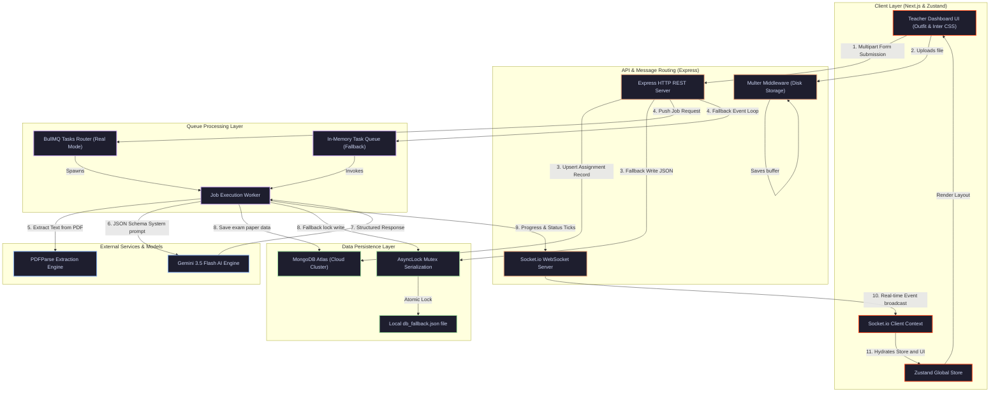

#  VedaAI — AI Assessment Creator & Teacher Portal

<p align="left">
  <a href="https://nextjs.org/"></a>
  <a href="https://expressjs.com/"></a>
  <a href="https://ai.google.dev/"></a>
  <a href="https://socket.io/"></a>
  <a href="https://www.mongodb.com/"></a>
  <a href="https://github.com/pmndrs/zustand"></a>
  <a href="https://www.typescriptlang.org/"></a>
</p>

Welcome to the **VedaAI AI Assessment Creator** — a high-fidelity, production-grade SaaS platform designed to automate and elevate the school examination lifecycle. Built to mirror strict Figma blueprints, it empowers teachers to compile physical-standard CBSE/NCERT question papers in seconds, analyze class performance statistics, manage lesson files, and refine AI outputs in real-time.

---

## ⚡ System Architecture

The ecosystem leverages a **decoupled, asynchronous, event-driven architecture** that ensures absolute separation of concerns, high throughput, and maximum client response speeds.

### 🔮 End-to-End System Data Flow



---

## 💎 Key Technical Approaches

### 1. 🛡️ Dual-Mode Persistence & Async Fallbacks
VedaAI is engineered with a **Zero-Setup Out-of-the-Box Execution Guarantee**. During bootstrap, backend services run diagnostics on your database and message brokers. If external dependencies are missing, failovers activate on-the-fly without breaking the user experience.

> [!NOTE]
> **Database Resilience (MongoDB vs. Atomic JSON fallback)**
> When the `MONGODB_URI` environment string is absent or unreachable, the system automatically redirects operations to the local storage engine (`DBStore.ts`). To prevent concurrent write conflicts, every JSON file write is serialized using a custom **AsyncLock Mutex Serialization** pipeline alongside an in-memory database cache, securing absolute transaction integrity.

> [!TIP]
> **Background Processing (BullMQ vs. Queue Emulator fallback)**
> If connection to Redis fails, the system switches to its custom **In-Memory Sequential Queue Emulator** (`QueueManager.ts`). Generation requests are handled outside the HTTP response-request cycle using `setImmediate` serialization. Live progress percentages and WebSocket event states update exactly like real BullMQ workers.

---

### 2. 🧠 Whitelisted Multi-Model Gemini Stack & Schema Control
To prevent generation blockages due to rate limits or region policies, VedaAI leverages a **Whitelisted Model Failover Stack**:

```text
[gemini-3.5-flash] ➔ [gemini-2.5-flash] ➔ [gemini-2.5-flash-lite] ➔ [gemini-2.5-pro] ➔ [gemini-2.0-flash] ➔ [gemini-1.5-flash] ➔ [gemini-1.5-pro] ➔ [gemini-pro] ➔ [Mock Compiler]
```

* **JSON Schema Enforcement**: For all supporting models, the API connection configurations are locked using `{ responseMimeType: "application/json" }`. This forces Gemini to output validated, parseable JSON arrays matching our TypeScript definitions, eliminating markdown formatting errors (e.g. `\`\`\`json` wraps).
* **Deterministic Offline Compiler**: If a developer API key is missing or internet connectivity is absent, the backend falls back to its deterministic mock compilation engine to generate high-quality, pre-seeded CBSE templates immediately.

---

### 3. ⚙️ Type-Safe Cross-Layer Data Models
To guarantee unified contract structures between client views and database collections, schemas are strictly locked using shared TypeScript definitions:

```typescript
export interface IQuestion {
  id: string;
  text: string;
  options?: string[]; // Populated with exactly 4 choices ONLY for Multiple Choice Questions (MCQs)
  difficulty: 'Easy' | 'Moderate' | 'Hard';
  marks: number;
  answer: string;      // Detailed scoring guide and resolution steps for examiners
}

export interface ISection {
  title: string;       // e.g. "Section A", "Section B"
  instruction: string; // e.g. "Attempt all questions. Each carries 1 mark"
  questions: IQuestion[];
}

export interface IQuestionPaper {
  assignmentId: string;
  schoolName: string;
  subject: string;
  gradeClass: string;
  timeAllowed: string;
  maxMarks: number;
  sections: ISection[];
  answerKey: { questionId: string; questionText: string; answer: string; }[];
}
```

---

## 🎁 Feature Showcases & Solutions

| Operational Challenge | VedaAI Solution Feature | Technical Implementation |
| :--- | :--- | :--- |
| **Exam Building Pain**: Manually drafting balanced NCERT/CBSE formats takes hours of chapter scanning. | <span style="color:#FF4E20">**15s AI Paper Creator**</span> | Extracts reference material text with `pdf-parse`, parses blueprint schemas, and requests whitelisted Gemini models. |
| **Fixed LLM Output Errors**: Static papers generated by AI require external editing software. | <span style="color:#e11d48">**Interactive WYSIWYG Canvas**</span> | Double-clicking or switching to "Edit Mode" renders live inline input grids, saving adjustments directly to the database. |
| **Inaccurate AI Questions**: Occasionally, AI questions are incorrect or mismatch difficulty. | <span style="color:#9333ea">**Single-Question Re-roller**</span> | A magic badge sends the single target question to a specialized, lightweight Gemini prompt endpoint to swap it out instantly. |
| **Exam Distribution Costs**: Printing templates requires complex styling structures. | <span style="color:#2563eb">**A4 CSS Physical Print**</span> | CSS `@media print` rules strip sidebars and dashboard blocks, restructuring paper margins for clean, offline A4 examiner sheets. |
| **Format Fragmentation**: Schools require standard formats to edit and store records offline. | <span style="color:#0284c7">**Native Microsoft Word Exporter**</span> | A zero-dependency browser XML serializer packages the paper directly into a vector-formatted MS Word document (`.doc`). |
| **Metric Tracking Headache**: Tracking class progress and performance averages requires manual sheets. | <span style="color:#16a34a">**SVG Analytics Dashboard**</span> | Integrates responsive, animated circular SVG charts to visualize class average indices and administrative hours saved. |

---

## 📂 Project Structure

```text
VedaAI-FullStack/
├── backend/
│   ├── src/
│   │   ├── controllers/      # Handlers (assignmentController.ts, toolkitController.ts)
│   │   ├── models/           # Mongoose schemas & shared TypeScript definitions (types.ts)
│   │   ├── queues/           # BullMQ integrations & sequential task Queue Emulator
│   │   ├── routes/           # REST endpoints (assignmentRoutes.ts, toolkitRoutes.ts)
│   │   ├── services/         # Business core (generator.ts, dbStore.ts)
│   │   ├── sockets/          # Socket.io channels and progress emitters
│   │   └── server.ts         # Gateway entry point & infrastructure diagnostics
│   ├── db_fallback.json      # Local fallback database (AsyncLock serialized transactions)
│   └── package.json          # Backend packages & command configurations
├── frontend/
│   ├── src/
│   │   ├── app/              # Next.js App Router folders (dashboard, assignments, toolkit, library)
│   │   │   ├── assignments/  # CBSE printing templates and question forms
│   │   │   ├── toolkit/      # AI Lesson Plans and Grading Rubrics builders
│   │   │   └── globals.css   # Main CSS design variables, color variables, & theme stylesheets
│   │   ├── components/       # Layout features (Sidebar, TopHeaderBar with dynamic notification logs)
│   │   ├── store/            # Zustand global state system (assignmentStore.ts)
│   │   └── utils/            # Shared tools (Socket.io client connector)
│   └── package.json          # Next.js dependency manifests
└── package.json              # Monorepo runner & concurrent operations settings
```

---

## 🚀 Operations Quick Start

### 1. Configure Environments

#### A. Backend Setup (`backend/.env`)
Create a `.env` file inside the `backend` folder:
```env
PORT=5000
NODE_ENV=development

# Gemini AI Credentials (Get a free key from https://aistudio.google.com)
GEMINI_API_KEY=your_gemini_api_key_here

# MongoDB Connection String (Optional - defaults to fallback local JSON database)
MONGODB_URI=

# Redis Connection (Optional - defaults to fallback sequential queue emulator)
REDIS_HOST=localhost
REDIS_PORT=6379
```

#### B. Frontend Setup (`frontend/.env.local`)
Create a `.env.local` file inside the `frontend` folder:
```env
NEXT_PUBLIC_API_URL=http://localhost:5000
NEXT_PUBLIC_SOCKET_URL=http://localhost:5000
```

---

### 2. Startup Command Pipelines

Run the following commands from the **root workspace directory**:

#### Step 1: Install Dependencies
Installs packages concurrently across the root project, the Next.js client, and the Express gateway:
```bash
npm run install:all
```

#### Step 2: Validate TypeScript Build
Compiles all codebases concurrently to verify absolute type-safety:
```bash
npm run build
```

#### Step 3: Spin Up Development Servers
Launches both development environments:
```bash
npm run dev
```

* 🖥️ **Teacher Dashboard Portal**: Open [http://localhost:3000](http://localhost:3000)
* ⚙️ **API Gateway Terminal**: Accessible on [http://localhost:5000](http://localhost:5000)

---

## 🛠️ Security & Advanced Quality Engineering

### 1. Client-Key Isolation & Secure Headers
To protect server-side developer credits, VedaAI supports isolated browser keys.
* **Storage Process**: Teachers can save their private Gemini developer API key inside the `/settings` interface. The credential sits securely in the browser's `localStorage` namespace.
* **Appended Routing**: During submission tasks, the frontend extracts this key and injects it under custom request headers (`x-gemini-key`). The backend server checks this custom header first before utilizing the default system API key, isolating key quotas and ensuring secure, credential-less server operations.

### 2. High-Speed PDF Text Extraction Stream Parsing
* PDF uploads are parsed using advanced memory buffers on the backend. The connection initializes modern, named `{ PDFParse }` class instances to prevent runtime prototype failures when handling scanned textbooks or heavy curriculum documents.

### 3. Physical Paper Page-Break Rules
* The physical print layout leverages custom `@media print` rules inside `globals.css` configured with absolute physical A4 borders. Margins, borders, sidebars, header navigation bars, and buttons are dynamically stripped, ensuring printed exam canvases format seamlessly without clipping.

### 4. Speech Prototype visualizer
* Clicking the microphone helper next to the instruction cards initiates a custom CSS Bezier wave pulse. This visualizer replicates smooth voice input prompts, elevating the modern styling of the creator interface.

---

## 👨‍💻 Submission Design Philosophy
This submission is designed to represent the pinnacle of full-stack recruitment engineering. From its responsive dark glassmorphic accent layout to its highly resilient fallback mechanics, VedaAI provides an ultra-premium, robust evaluation experience. Have fun building papers with **VedaAI**!
