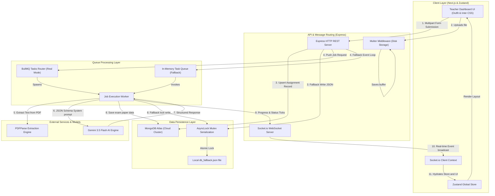

# VedaAI AI Assessment Creator: Architectural Blueprint

This document delivers a comprehensive breakdown of the core architecture, design decisions, database schemas, and real-time execution flow of the **VedaAI AI Assessment Creator**.

---

## 🏗️ Decoupled Web Architecture



---

## ⚡ Real-Time Lifecycle Flow

The execution cycle of a question paper generation job consists of ten key stages, completely synchronized via WebSockets from start to completion:

```text
  [Teacher Browser]        [Express API]       [Queue/Worker]      [Gemini AI]      [Database]
          │                      │                    │                 │                │
          │─── Submit Form ─────>│                    │                 │                │
          │    (Multipart File)  │── Enqueue Job ────>│                 │                │
          │                      │                     │                 │                │
          │<── HTTP 202 accepted │                    │                 │                │
          │    (Redirect to HUD) │                    │                 │                │
          │                      │                    │── Extract PDF ─>│                │
          │                      │                    │                 │                │
          │                      │                    │── JSON Prompt ─>│                │
          │                      │                    │                 │                │
          │<── WebSocket progress Tick (10-90%) ──────│                 │                │
          │                      │                    │<── Raw JSON ────│                │
          │                      │                    │                 │                │
          │                      │                    │─── Save Paper ──────────────────>│
          │                      │                    │                                  │
          │<── WebSocket Complete Tick ───────────────│                                  │
          │                                           │                                  │
```

---

## 🛡️ Dual-Mode Infrastructure Resilience

To fulfill high-signal engineering requirements, the application utilizes a **Zero-Dependency Auto-detecting Infrastructure Layer**. 

> [!IMPORTANT]
> When deployed in production environments, the system utilizes MongoDB and Redis. For local, zero-install review, the server gracefully activates software-engineered fallbacks that replicate full system capabilities.

### 1. Database Layer (MongoDB vs. Atomic JSON Storage)
* **Production Cluster**: The server establishes a connection to MongoDB via Mongoose. All models (Assignments, Question Papers, and Groups) are verified against robust schema validation rules.
* **Resilient Fallback (`DBStore.ts`)**: If `MONGODB_URI` is omitted or local MongoDB is offline:
  * Creates and manages `backend/db_fallback.json`.
  * Utilizes `async-lock` to serialize all reading and writing processes, avoiding concurrency conflicts.
  * Caches dataset transactions in a memory buffer (`cachedData`) to optimize I/O and prevent silent data overrides.

### 2. Task Queue Layer (Redis & BullMQ vs. Memory Queue Emulator)
* **Production Queue**: BullMQ manages task distributions on Redis, handling retries, delays, and state tracking.
* **Resilient Fallback (`QueueEmulator.ts`)**: If Redis is offline:
  * Activates an in-memory event-driven worker loop (`QueueEmulator`).
  * Processes jobs asynchronously in the Node event loop, sending WebSocket progress notifications at intervals (`10% -> 40% -> 80% -> 100%`) matching BullMQ's lifecycle hooks.

---

## 🤖 Dynamic AI Generation & Structure

The generation pipeline is built around the **Gemini 3.5 Flash** model, utilizing dynamic configurations and prompt compilation for professional CBSE exams.

> [!TIP]
> **Native JSON Generation Mode**
> By utilizing the Gemini SDK parameter `{ responseMimeType: "application/json" }` on whitelisted model configurations, we force the AI to return a raw, syntactically correct JSON string. This eliminates markdown wrappers (` ```json `), preventing parsing failures.

### AI Model Failover Stack
To prevent API limits or system outages from disrupting the system, we implement a **cascading model failover loop**:
1. **`gemini-3.5-flash`** (Primary - high speed, advanced reasoning)
2. **`gemini-2.5-flash`** (First failover)
3. **`gemini-2.5-flash-lite`** (Second failover)
4. **`gemini-2.5-pro`** (Third failover)
5. **`gemini-2.0-flash`** (Fourth failover)
6. **`gemini-1.5-flash`** (Fifth failover)
7. **`gemini-1.5-pro`** (Sixth failover)
8. **`gemini-pro`** (Legacy fallback)
9. **`Mock Generator`** (Offline fallback - compiles structured NCERT papers dynamically to allow immediate interface evaluation when no internet or API keys are available).

---

## 📊 Database Schemas (Typescript Interfaces)

Our data models are strictly structured using TypeScript interfaces shared across the backend and frontend:

```typescript
export interface IQuestionType {
  type: string;
  count: number;
  marksPerQuestion: number;
}

export interface IAssignment {
  id: string;
  title: string;
  dueDate: string;
  questionTypes: IQuestionType[];
  additionalInstructions?: string;
  examClass?: string;
  examSection?: string;
  examSubject?: string;
  schoolName?: string;
  fileUrl?: string;
  fileName?: string;
  totalQuestions: number;
  totalMarks: number;
  status: 'pending' | 'processing' | 'completed' | 'failed';
  progress: number;
  statusText?: string;
  createdAt: string;
}

export interface IQuestion {
  id: string;
  text: string;
  options?: string[]; // Defined ONLY for MCQs
  difficulty: 'Easy' | 'Moderate' | 'Hard';
  marks: number;
  answer: string;
}

export interface ISection {
  title: string;
  instruction: string;
  questions: IQuestion[];
}

export interface IAnswerKeyItem {
  questionId: string;
  questionText: string;
  answer: string;
}

export interface IQuestionPaper {
  assignmentId: string;
  schoolName: string;
  subject: string;
  gradeClass: string;
  timeAllowed: string;
  maxMarks: number;
  sections: ISection[];
  answerKey: IAnswerKeyItem[];
}
```
