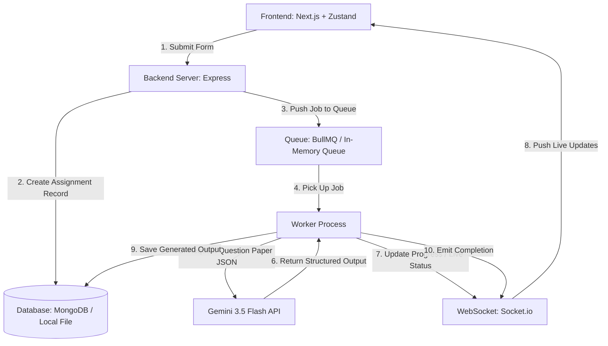

# VedaAI AI Assessment Creator: System Architecture

This document describes the high-level architecture, design decisions, and real-time flow of the AI Assessment Creator.

---

## High-Level System Flow

---

## Architectural Breakdown

### 1. Frontend System (Next.js 14+)
- **State Management**: Built using **Zustand** to store the active assignments list, loading states, and WebSocket notifications.
- **Styling**: Structured using pure **Vanilla CSS** through modular CSS (`.module.css`) to enforce scoped classes, eliminating ad-hoc styling while matching the pixel-perfect Figma design.
- **WebSocket Manager**: Connects to the backend Socket.io server. It registers connection rooms using the `assignmentId` and listens for progress events.

### 2. Backend Server (Express + Socket.io)
- **API Router**: Exposes RESTful endpoints to create assignments, list existing runs, retrieve question papers, and delete records.
- **WebSocket Handler**: Connects individual clients to room-based channels, allowing targeted event emissions so a user only gets notifications for their specific generation run.

### 3. Background Queue & Worker System
- **Real Mode**: Uses **BullMQ** on top of **Redis** to ensure durable queue state, distributed execution, and atomic locks.
- **Fallback Mode**: If Redis is not available, it uses an in-memory async task runner (`QueueEmulator`) which processes assignments sequentially using Node's event loop, retaining progress intervals and error management.

### 4. Database Layer
- **Real Mode**: Uses **Mongoose** to connect to MongoDB, validating schemas for Assignments and Question Papers.
- **Fallback Mode**: Uses a local JSON file store (`db_fallback.json`) which mimics Mongoose CRUD operations. Fully fortified with:
  - **`AsyncLock` Mutex Serialization**: Sequences all concurrent route and background task database reads/writes, resolving race conditions.
  - **In-Memory Cache Buffer (`cachedData`)**: Caches state in memory to gracefully buffer disk I/O and prevent silent data resets during partial write file stream states.

### 5. AI Generation Service & Document Extraction
- Formulates a highly structured prompt incorporating NCERT subject parameters, CBSE sections, and custom question distributions.
- **Modern `pdf-parse` Class Engine**: Integrates modern cross-platform `PDFParse` class-based extraction to parse uploaded reference materials swiftly directly on the backend.
- Invokes the **Gemini API** with system instructions demanding strict JSON output, validating section lists, question structures, and examiners answer keys in real-time.

