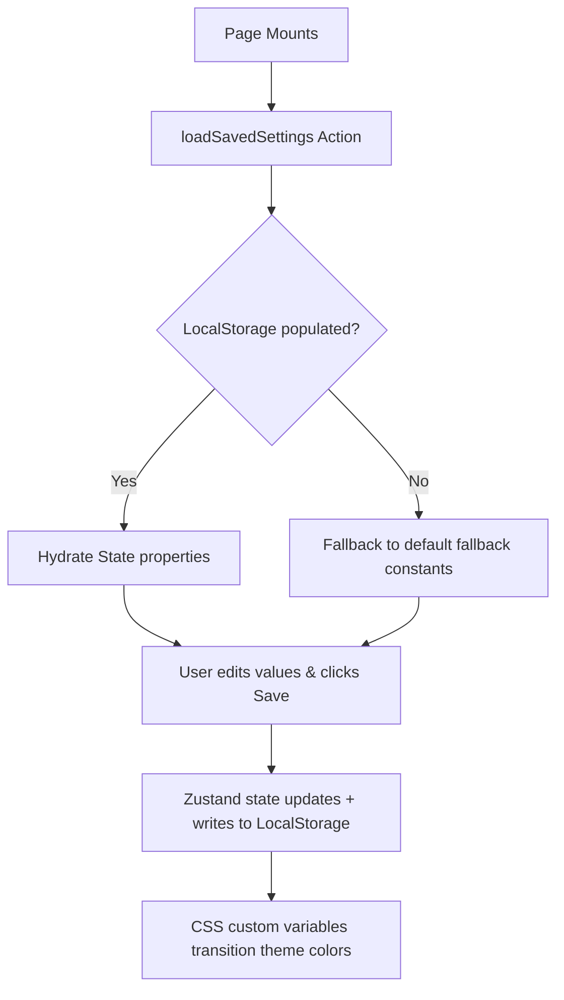

# Page Specification: Settings & Configuration Panel

A comprehensive administration panel where teachers configure institutional credentials, customize default parameters for assessment generation, securely input developer API keys, and toggle premium visual themes.

---

## 💡 Teacher Perspective (Occupational Pains Solved)
- **Problem 1: Redundant Institutional Data Entry**: Typing the school name ("Delhi Public School") and branch ("Sector-4, Bokaro") every single time they want to generate an A4 question paper is incredibly annoying and prone to typos.
- **Problem 2: API Rate Limits and Quotas**: Educational platforms often hit collective AI token limits. Under high stress, generations fail due to public/shared key exhaustion.
- **Solution**: The Settings Panel solves both! It auto-saves school credentials so they pre-populate on all new CBSE worksheets. Additionally, it features an **Isolated API Key Manager** that saves the teacher's own Gemini key directly to the browser's safe local storage, giving them unlimited dedicated API quotas.
- **Problem 3: Classroom Environmental Lighting**: Grading at night in a bright white browser causes eye strain.
- **Solution**: Sleek Light Mode and Harmonious Dark Mode selectors allow instant lighting adjustments.

---

## 🎨 Visual Layout & UI Specifications (Figma Grid)
The settings canvas is organized as a single clean grid split into focused configuration cards:
- **Header**: Main title "Settings" and a subtitle *"Manage your profile, system preferences, and API configuration."*
- **Card 1: Institutional & Profile Customizer**:
  - Grid layout featuring input fields for:
    - *School / Institution Name* (e.g. `Delhi Public School`)
    - *Branch Location* (e.g. `Sector-4, Bokaro`)
    - *Teacher Name* (e.g. `John Doe`)
  - A profile avatar circle with an edit overlay to upload custom school logos.
- **Card 2: Isolated API Key Manager**:
  - Secure input field labeled *"Gemini Developer API Key"* utilizing `type="password"`.
  - An eye icon button positioned absolutely on the right to toggle text visibility (`type="text"` vs `type="password"`).
  - A small description: *"Your key is saved locally in your browser and is never sent to our servers except to direct requests to the Gemini API."*
- **Card 3: Default Generation Configurator**:
  - Number input selector for *Default Time Allowed (Minutes)*.
  - Dropdown selector for *Default Grade / Class* (e.g. `Class 5th`, `Class 10th`).
  - Text field for *Default Subject*.
- **Card 4: Premium Theme Selector**:
  - A two-column responsive grid with visual preview cards:
    - **Sleek Light Card**: Clean border, white canvas, and soft gray accent lines representing the light mode grid.
    - **Harmonious Dark Card**: Dark border, charcoal slate (`#1E293B`) canvas, and gold/orange accent details representing the dark mode grid.
- **Footer Actions**: A floating button block containing a subtle `Reset Defaults` secondary button and a glowing high-contrast orange-red `Save Preferences` button.

---

## 🗄️ Zustand State Store Information (Global State Map)

To manage settings persistently without adding database sync lag, the Settings panel binds to a dedicated Zustand slice or browser local storage controller:

### 1. Selected Store Properties
- `schoolName` (`string`): Bound to profile inputs; defaults to `'Delhi Public School'`.
- `branchName` (`string`): Bound to branch inputs; defaults to `'Sector-4, Bokaro'`.
- `defaultTime` (`number`): Initialized at `45` minutes.
- `defaultClass` (`string`): Initialized at `'Class 5th'`.
- `theme` (`'light' | 'dark'`): Controls global HTML element class lists.
- `userApiKey` (`string | null`): Secured developer API key.

### 2. Selected Store Actions
- `updateSettings` (`(settings: Partial<Settings>) => void`): Mutates active memory states and saves them to local storage.
- `saveApiKey` (`(key: string) => void`): Securely writes custom API key to standard local storage keys.
- `loadSavedSettings` (`() => void`): Hydrates all setting variables from local storage upon app initialization.
- `toggleTheme` (`(newTheme: 'light' | 'dark') => void`): Toggles active CSS variable classes.

### 3. State Management Lifecycle

---

## 🔌 E2E Backend & Prompt Pipelines
- **API Key Headers Proxy**: When generating a new assignment, the frontend checks if `userApiKey` is populated in the store. If yes, it attaches it as a custom request header:
  `x-gemini-key: <userApiKey>`
  The Express server retrieves this header. If present, it initializes the Gemini SDK with the teacher's key instead of the system environment key, shielding the platform from quota crashes!
- **CSS Variables Mapping**: Toggling themes injects high-fidelity colors into the document root:
  - **Light mode**:
    `--bg-app: #F8FAFC`, `--bg-card: #FFFFFF`, `--text-main: #0F172A`
  - **Dark mode**:
    `--bg-app: #0B0F19`, `--bg-card: #141B2D`, `--text-main: #F1F5F9`
